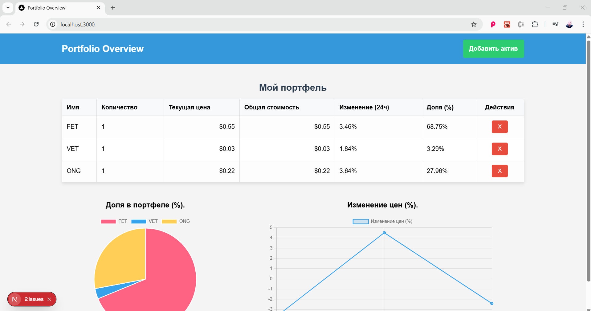
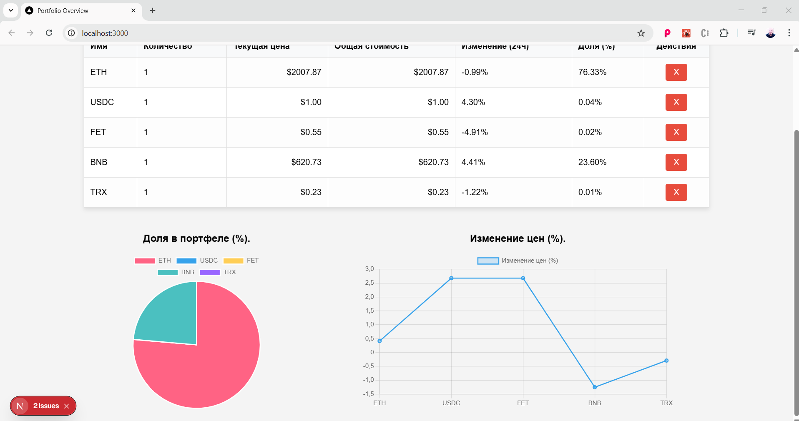
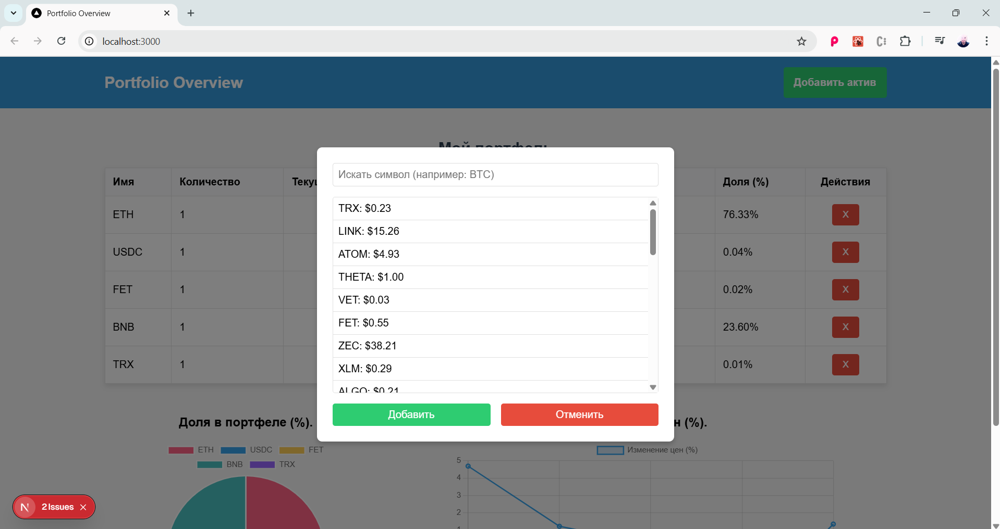

# 📊 Управление портфелем финансовых активов

Этот проект — это приложение, разработанное с использованием **Next.js** и **TypeScript**, ориентированное на управление портфелем финансовых активов. Оно интегрируется с **WebSocket** для получения данных о ценах активов в реальном времени. Приложение использует **Redux Toolkit** для управления глобальным состоянием и **localStorage** для локального сохранения данных. Кроме того, реализована визуализация данных с помощью библиотеки **Chart.js**.

## 🚀 Функциональность

- 📌 Добавление активов в портфель.
- 📊 Отображение детальной информации о каждом активе, такой как **название, количество, текущая цена, общая стоимость, изменение за последние 24 часа и доля в портфеле**.
- ❌ Удаление активов из портфеля с помощью специальной кнопки.
- 💾 Сохранение данных портфеля локально с использованием **localStorage**.
- 📈 Визуализация данных с помощью библиотеки **Chart.js**.
- 🔎 Модальное окно для поиска и выбора активов по **символу**.
- 📱 **Адаптивный дизайн**, обеспечивающий удобное использование на разных устройствах.

## 🛠 Используемые технологии и библиотеки

- **Next.js**
- **TypeScript**
- **Redux Toolkit**
- **WebSocket**
- **localStorage**
- **Sass** для стилизации
- Методологии **SMACSS и BEM** для CSS
- **Chart.js**

Проект соответствует **лучшим практикам разработки** и разработан с учетом **расширяемости и масштабируемости**.

## 📂 Структура проекта

```
/src
  ├── app/          # Входная точка проекта
  ├── components/   # Компоненты приложения
  ├── redux/        # Store и slices Redux
  ├── services/     # WebSocket-интеграция для портфелей
  ├── styles/       # Файлы стилей с использованием Sass
```

## 📥 Как скачать и запустить проект

1. Клонируйте репозиторий:
   ```sh
   git clone https://github.com/jordanwmp/portifolio-oerview-next.js.git
   ```
2. Перейдите в каталог проекта:
   ```sh
   cd portifolio-oerview-next.js
   ```
3. Установите зависимости:
   ```sh
   npm install
   ```
4. Запустите сервер разработки:
   ```sh
   npm run dev
   ```
5. Откройте приложение в браузере:
   ```
   http://localhost:3000
   ```

## 🌍 Доступ к проекту онлайн

Проект доступен на GitHub Pages:
🔗 [Открыть здесь](https://jordanwmp.github.io/portifolio-oerview-next.js)

## 📸 Скриншоты





Если вам нужна дополнительная информация или изменения, дайте мне знать! 🚀

